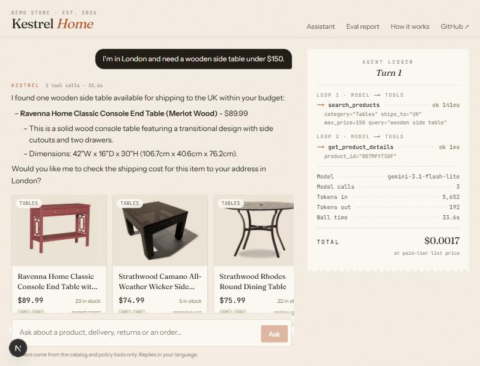

# Kestrel Home — AI shopping assistant

A customer-support agent for a (fictional) furniture store that ships to the US and UK. It answers product, shipping, returns and order questions by calling tools over a real product catalog, and it comes with an eval suite that measures every change.

**Live demo:** [kestrel-home.vercel.app](https://kestrel-home.vercel.app) · **Eval report:** [/eval](https://kestrel-home.vercel.app/eval) · **How it works:** [/how-it-works](https://kestrel-home.vercel.app/how-it-works)

> Everything runs on free tiers. The API (Render) sleeps after 15 idle minutes, so the first message can take about a minute while it wakes up. Gemini's free tier is also slow at times (a few seconds to tens of seconds per model call). The ledger next to each answer shows where the time went.



## What it does

- **RAG over 453 real products** (Amazon Berkeley Objects) and 5 policy documents: hybrid search in Qdrant (dense `bge-small-en-v1.5` + BM25, merged with Reciprocal Rank Fusion), with price, category, country and stock filters applied inside the vector search.
- **An explicit agent loop in LangGraph**: model → tools → model, with a step cap, tool errors fed back to the model so it can correct itself, a token budget on history, and a fixed fallback when the loop runs out of steps.
- **Six tools for everything that must be exact**: product search, product details (inches and cm), policy search, shipping quote with UK VAT rules, order lookup (id + email), human handoff.
- **Streaming API** (FastAPI, Server-Sent Events) that streams the answer and every tool call with its latency, tokens and cost.
- **Eval suite**: 41 customer questions with code checks (right tool, right filters, right policy section, every price traceable to a tool result) plus an LLM judge, run across models and prompt versions. A separate retrieval eval compares dense, BM25 and hybrid search.
- **Next.js 16 frontend**: chat with product cards and an "agent ledger" that itemises each loop step like a receipt; an eval report page with every answer and its trace.

## Results

See [`backend/eval/README.md`](backend/eval/README.md) for how the eval works, the grader bugs found along the way, and why each prompt rule exists.

<!-- RESULTS:START -->
Agent eval: 41 questions, code checks decide pass/fail, judge = gemini-3.5-flash-lite (1–5).

| Model | Prompt | Pass | Faithful | Helpful | Median time | Model calls | Cost / question* |
|---|---|---:|---:|---:|---:|---:|---:|
| Gemini 3.1 Flash-Lite | v3 | **95%** | 5 | 5 | 29.8s | 2 | $0.0010 |
| Gemini 3.1 Flash-Lite | v1 | **93%** | 5 | 5 | 32.4s | 1.95 | $0.0007 |
| Gemini 3.1 Flash-Lite | v2 | **93%** | 4.95 | 5 | 30.1s | 1.98 | $0.0009 |
| Gemini 3.5 Flash-Lite | v3 | **78%** | 4.85 | 5 | 30.2s | 2.24 | $0.0015 |

*Paid-tier list price for the tokens used; the demo itself runs on the free tier. Times include free-tier queueing (12 requests/minute per model).

Retrieval eval: 80 shopper-style queries, no model in the loop.

| Search | hit@1 | hit@5 | MRR |
|---|---:|---:|---:|
| dense | 88% | 98% | 0.91 |
| sparse | 89% | 99% | 0.94 |
| hybrid | 91% | 100% | 0.95 |
| dense + category filter | 88% | 98% | 0.92 |
| sparse + category filter | 89% | 99% | 0.94 |
| hybrid + category filter | 91% | 100% | 0.95 |
<!-- RESULTS:END -->

## Project B: Listing Studio

**[/studio](https://kestrel-home.vercel.app/studio)**: upload a product photo (or pick one from the catalog) and get a marketplace listing, SEO title and description, three Meta ads, similar products from the store, and a Shopify import CSV.

- **Vision → structured facts**: Gemini reads category, colours, materials, style and visible features into a Pydantic schema, and flags photo problems (dimension diagram, lifestyle scene, several products).
- **Copy from facts only**: a second call writes the listing and ads from those facts plus the seller's notes (price, size, offers). Anything a photo cannot prove, like assembly, durability, "handmade" or "free shipping", is off limits unless the seller says so.
- **Check → repair loop**: code checks every draft against platform limits (Etsy title 140, 13 tags of ≤ 20 characters, SEO title 70, meta description 50–160, Meta ad text 125/40/30), risky ad claims ("best", "#1", "guaranteed", health claims) and numbers that appear in neither the facts nor the notes. Violations go back to the model for a rewrite, at most twice; anything still failing is flagged for a person.
- **Visual search without an image model**: the photo's description is searched with the store's existing hybrid index, so the free 512 MB host needs no extra RAM. Image-embedding models were measured offline as the comparison.
- **Shopify CSV**: one draft product per file, HTML-escaped body, only catalog image URLs.

<!-- STUDIO:START -->
Listing Studio eval: 40 products, scored against the catalog's own metadata.

| Metric | Result |
|---|---:|
| Category read from photo | 87% |
| Colour read from photo | 82% (n=17) |
| Material read from photo | 85% (n=13) |
| Copy passes all rules: first draft → after repair loop | 91% → 100% |
| Copy with no unsupported claims (LLM judge) | 56% |
| Visual search, other photo of same product: hit@1 / hit@5 | 26% / 56% |
| Cost per listing* | $0.0019 |

Visual search on the same 23 query photos (image models also on all 435):

| Approach | hit@1 | hit@5 | Extra RAM | hit@5, all |
|---|---:|---:|---:|---:|
| Gemini describes photo → hybrid text search (live) | 26% | 56% | 0 MB | – |
| Qdrant/clip-ViT-B-32-vision embeddings | 43% | 52% | 454 MB | 59% |
| google/siglip2-base-patch16-224 embeddings | 70% | 83% | 1232 MB | 85% |
| nomic-ai/nomic-embed-vision-v1.5-Q embeddings | 43% | 52% | 1580 MB | 64% |
| Qdrant/resnet50-onnx embeddings | 30% | 39% | 543 MB | 48% |
<!-- STUDIO:END -->

## Architecture

```
Browser (Next.js) ──POST /api/chat──▶ FastAPI ──▶ LangGraph agent loop ──▶ Gemini (tool calling)
      ▲                                  │               │
      └──────── SSE: step / products / token / done ─────┘
                                                         ▼
                              tools: search_products ─▶ Qdrant (dense + BM25, payload filters)
                                     search_store_policies ─▶ Qdrant (policy sections)
                                     get_product_details / quote_shipping / lookup_order ─▶ catalog + orders (code)
                                     handoff_to_human ─▶ ticket
```

## Run it locally

Backend (Python 3.11):

```bash
cd backend
python -m venv .venv && .venv/Scripts/activate   # or source .venv/bin/activate
pip install -r requirements-dev.txt
cp .env.example .env                              # add GEMINI_API_KEY
python scripts/build_index.py                     # embeds catalog + policies into ./.qdrant
uvicorn app.main:app --port 8077
pytest -q                                         # 37 tests, no API key needed
```

Frontend (Node 22):

```bash
cd frontend
npm install
npm run dev -- --port 3210                        # expects the API on http://localhost:8077
```

Eval:

```bash
cd backend
python -m eval.run_eval --model gemini-3.1-flash-lite --prompt v3
python -m eval.retrieval_eval
python -m eval.rejudge
cd ../frontend && npm run sync-eval
```

Deploy: the API is a Docker image (`backend/Dockerfile`, 1 worker, ~380 MB RAM) described in `render.yaml` (Render free tier, Singapore); the frontend is on Vercel with `NEXT_PUBLIC_API_URL` pointing at the API.

Rebuilding the catalog from the raw dataset (optional; `data/catalog.jsonl` is committed): download `listings/metadata/*.json.gz` and `images/metadata/images.csv.gz` from the [ABO bucket](https://amazon-berkeley-objects.s3.amazonaws.com/index.html) into `backend/data/raw/`, then `python scripts/build_catalog.py`.

## Layout

```
backend/
  app/
    main.py            FastAPI + SSE streaming, validation, rate limit
    agent/graph.py     LangGraph loop, history trimming, tool runner
    agent/tools.py     the six tools
    agent/prompts.py   prompt v1 / v2 / v3
    agent/llm.py       model factory, per-model rate limiter, price table
    rag/               documents, Qdrant index, hybrid search
  scripts/             build_catalog.py, build_index.py
  eval/                dataset, checks, judge, runners, results
  tests/               tools, search, agent loop (scripted model), API, checks
frontend/
  app/                 chat, /eval, /how-it-works
  components/          ChatApp, Ledger, ProductCard, CaseExplorer
```

## Decisions worth knowing

- **Code owns the numbers.** Prices, shipping costs, VAT thresholds and unit conversions come from tools. The eval checks that every money amount in an answer appears in a tool result.
- **Filters live in the vector search**, not in the prompt. A budget or a country is a Qdrant payload filter, so out-of-range products never reach the model.
- **Stateless server.** The browser sends the history; assistant turns carry the ids of the products they showed, so follow-ups like "how big is it?" resolve without server sessions.
- **Embedded Qdrant** keeps the demo to one container. It allows one process, so the API runs one worker; `QDRANT_URL` switches to a Qdrant server.
- **Model choice is an eval result plus a constraint**: the demo must run on the Gemini free tier, where Gemini 3.5 Flash allows 20 requests a day. Flash-Lite models were compared on the same 41 questions.

## Data and licence

Product names, materials, dimensions and photos: [Amazon Berkeley Objects](https://amazon-berkeley-objects.s3.amazonaws.com/index.html), CC BY 4.0. Prices, stock, UK shipping eligibility, orders and the store itself are made up. Code: MIT.

Built by Leo (Le Thanh Thuan) — [github.com/LEO17061996](https://github.com/LEO17061996)
